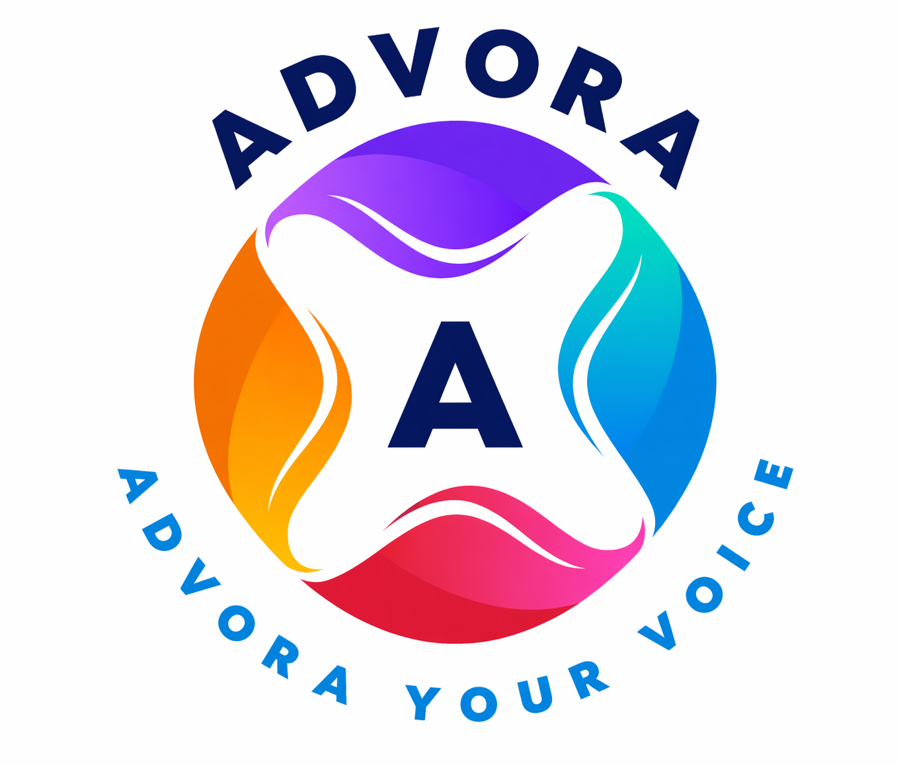

<div align="center">
  

  <h1>Advora — Your Voice</h1>

  <p><strong>AI-powered Instagram content automation for financial advisors</strong></p>

  <p>
    
    
    
    
    
    
  </p>
</div>

---

## What is Advora?

Financial advisors are too busy to consistently post on Instagram — but a consistent presence is essential for growing their practice. **Advora automates the entire content pipeline**, from idea to published post, with a single WhatsApp tap for approval.

> **AI generates it. WhatsApp delivers it. Instagram publishes it. Analytics improve it.**

---

## How It Works

```
  Every day at the advisor's chosen time
         │
         ▼
  AI writes a finance post  ──────────────────────────────────────────
  (caption, hook, hashtags)  ← learns from past engagement over time │
         │                                                            │
         ▼                                                            │
  WhatsApp sends it for approval                                      │
         │                                                            │
    ┌────┴────┐                                                        │
    │ Approve │ → AI generates image → Published to Instagram         │
    │Regenerate│ → Fresh post generated instantly                      │
    └─────────┘         │                                             │
                        ▼                                             │
               Analytics tracked at 24h / 72h / 7d ─────────────────┘
```

---

## Key Features

- 🤖 **AI Content Generation** — GPT-4o-mini produces captions, hooks, and hashtags across 200+ finance topics
- 🎨 **AI Image Creation** — DALL-E 3 generates a custom image for every post
- 📱 **WhatsApp Approval** — one-tap approve or regenerate from the advisor's phone
- 📸 **Auto-Publishing** — single images and multi-slide carousels posted via Instagram Graph API
- 📊 **Engagement Analytics** — impressions, likes, saves, and engagement rate per post
- 🔁 **Self-Improving AI** — content strategy adapts based on what performs best per advisor
- ⏰ **Per-User Scheduling** — each advisor sets their own daily post time and timezone
- 🔐 **Secure by Design** — Meta OAuth 2.0, encrypted token storage, Supabase Row-Level Security

---

## Tech Stack

**Backend** — FastAPI · PostgreSQL (Supabase) · APScheduler · OpenAI API · Cloudinary · WhatsApp Cloud API · Instagram Graph API · Fernet encryption · structlog

**Frontend** — Next.js 16 · TypeScript · Tailwind CSS · Recharts · Supabase SSR

**Infrastructure** — Supabase (auth + database) · Cloudinary (image CDN) · Meta Developer Platform

---

## Dashboard

The frontend is a fully responsive SaaS dashboard with:

- **Overview** — live status cards, recent drafts, quick actions
- **Drafts** — paginated list with status filters and per-post analytics
- **Analytics** — engagement charts and top-performing theme rankings
- **Connect** — Instagram OAuth connection and token management
- **Settings** — profile, WhatsApp number, schedule, and scheduler toggle

Mobile-first layout with a slide-out sidebar drawer and bottom tab navigation.

---

## About

This project was built as a full-stack production-grade SaaS — covering AI integration, third-party OAuth, webhook handling, async job scheduling, encrypted credential storage, and a fully branded responsive frontend.

**Built by [Rajender Gugulothu](https://github.com/rajendergugulothu)**

---

<div align="center">
  
  <br/>
  <em>Advora — Your Voice</em>
</div>
